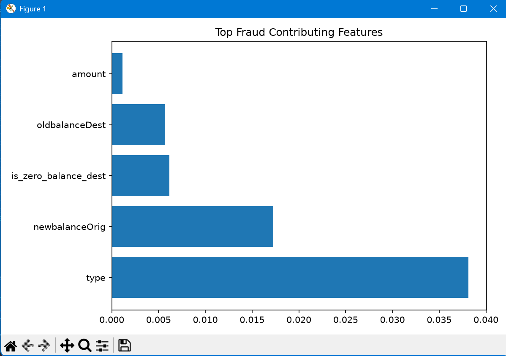
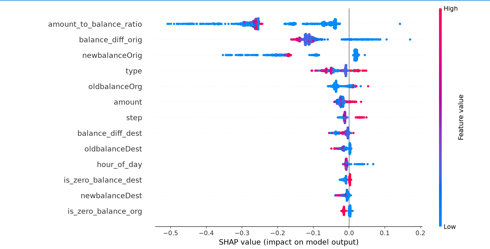

# Phase 5: Explainable AI (SHAP)

## Objective

The objective of this phase was to make fraud predictions transparent and interpretable. Instead of only predicting whether a transaction is fraudulent, the system explains why the prediction was made using SHAP (SHapley Additive exPlanations).

---

# Explainability Approach

Model Used:

* Random Forest Classifier

Explainability Framework:

* SHAP TreeExplainer

SHAP was used to calculate the contribution of each feature toward the final fraud prediction.

This enables fraud analysts to understand which transaction characteristics influenced the model's decision.

---

# Global Explainability

Global explainability helps identify the most important features affecting fraud detection across the entire dataset.

## Top Features Identified

1. amount_to_balance_ratio
2. balance_diff_orig
3. newbalanceOrig
4. type
5. oldbalanceOrg

These features consistently showed the highest impact on model predictions.

---

# SHAP Summary Plot Analysis

The SHAP summary plot was generated using 1000 randomly sampled transactions.

Observations:

* amount_to_balance_ratio had the highest overall impact.
* balance_diff_orig strongly influenced fraud predictions.
* Transaction type played an important role in distinguishing fraudulent and genuine transactions.
* Account balance related features were more informative than transaction amount alone.
* Fraudulent behavior was primarily characterized by abnormal balance movements and unusual transaction-to-balance relationships.

---

# Local Explainability

Local explainability provides feature-level reasoning for individual transactions.

For each transaction, SHAP values were calculated and converted into human-readable explanations.

---

# Example 1: Non-Fraud Transaction

Prediction:

* Non-Fraud

Fraud Probability:

* 0.0

Top Reasons:

* Transaction-to-balance ratio reduced fraud risk.
* Sender balance discrepancy reduced fraud risk.
* Sender account balance pattern reduced fraud risk.
* Receiver balance discrepancy reduced fraud risk.
* Transaction type slightly increased fraud risk.

Conclusion:

Although the transaction type contributed positively toward fraud risk, stronger balance-related features pushed the final prediction toward Non-Fraud.

---

# Example 2: Fraud Transaction

Prediction:

* Fraud

Fraud Probability:

* 99.98%

Top Contributing Features:

* balance_diff_orig
* amount_to_balance_ratio
* newbalanceOrig
* oldbalanceOrg
* hour_of_day

Business Interpretation:

* Large sender balance discrepancy detected.
* Abnormal transaction-to-balance ratio observed.
* Suspicious sender account balance pattern.
* Unusual transaction timing.
* Account balance behavior matched known fraud patterns.

Conclusion:

Multiple high-impact features collectively pushed the prediction toward Fraud with extremely high confidence.

---

# Risk Scoring Engine

To improve interpretability, prediction probabilities were converted into risk scores.

Risk Score Formula:

Risk Score = Fraud Probability × 100

## Risk Categories

### Low Risk

Score: 0 – 49

### Medium Risk

Score: 50 – 79

### High Risk

Score: 80 – 100

Example:

Fraud Probability = 0.9998

Risk Score = 100

Risk Category = High Risk

---

# Benefits of Explainability

The explainability module provides several benefits:

* Improves trust in model predictions.
* Assists fraud analysts during investigations.
* Supports auditability and regulatory requirements.
* Enables transparent decision making.
* Helps identify important fraud-driving features.
* Reduces the "black-box" nature of machine learning models.

---

# Deliverables Completed

* SHAP Integration
* TreeExplainer Implementation
* Global Feature Importance Analysis
* SHAP Summary Plot
* Individual Transaction Explanations
* Fraud Transaction Explanation
* Non-Fraud Transaction Explanation
* Human-Readable Explanation Engine
* Risk Score Calculation
* Risk Categorization Logic

---

# Phase 5 Outcome

An explainable fraud detection system was successfully developed. The model can now provide both fraud predictions and detailed reasoning behind those predictions, making the solution more suitable for real-world financial fraud detection workflows.

## SHAP Summary Plot

![SHAP Summary Plot](image.png)

## SHAP Feature Importance Plot

